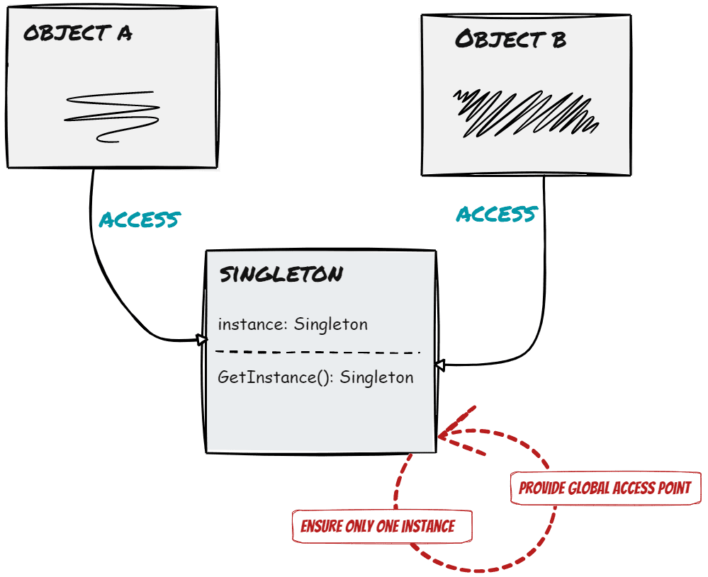

# design-pattern
In this repository, you will find examples of popular design patterns such as Singleton, Factory, Strategy, Decorator, Observer, and many more. Each example comes with a detailed description of how to apply that design pattern in Golang, along with reference materials so that you can better understand them.

<h2>&#9733; Creational Patterns (6) &#9733;</h2>
<h3> Singleton Pattern </h3>

 Level of difficult: &#9733; &#x2606; &#x2606; &#x2606; &#x2606;

 Popular: &#9733; &#9733; &#9733; &#9733; &#x2606;

 Singleton Pattern allows creating only one object (object) of a class (class) in the entire application. The idea of the Singleton Pattern is to ensure that a class has only a single object and to provide a global point of access to this object. Usually used in situations where you want to ensure that only a single object will be created in the system, for example database access, resource objects, or system settings. 

<h3> Simple Factory Pattern </h3>

 Level of difficult: &#9733; &#9733; &#x2606; &#x2606; &#x2606;

 Popular: &#9733; &#9733; &#9733; &#x2606; &#x2606;

<h3> Factory Method Pattern </h3>

 Level of difficult: &#9733; &#9733; &#x2606; &#x2606; &#x2606;

 Popular: &#9733; &#9733; &#9733; &#9733; &#9733;

<h3> Abstract Factory Pattern </h3>

 Level of difficult: &#9733; &#9733; &#9733; &#9733; &#x2606;

 Popular: &#9733; &#9733; &#9733; &#9733; &#9733;

<h3> Prototype Pattern </h3>

 Level of difficult: &#9733; &#9733; &#9733; &#x2606; &#x2606;

 Popular: &#9733; &#9733; &#9733; &#x2606; &#x2606;

<h3> Builder Pattern </h3>

 Level of difficult: &#9733; &#9733; &#9733; &#9733; &#x2606;

 Popular: &#9733; &#9733; &#x2606; &#x2606; &#x2606;

<h2>&#9733; Structural Patterns (7) &#9733;</h2>
<h3> Adapter Pattern </h3>

 Level of difficult: &#9733; &#9733; &#x2606; &#x2606; &#x2606;

 Popular: &#9733; &#9733; &#9733; &#9733; &#x2606;

<h3> Bridge Pattern </h3>

 Level of difficult: &#9733; &#9733; &#9733;  &#x2606; &#x2606;

 Popular: &#9733; &#9733; &#9733; &#x2606; &#x2606;

<h3> Composite Pattern </h3>

 Level of difficult: &#9733; &#9733; &#9733;  &#x2606; &#x2606;

 Popular: &#9733; &#9733; &#9733; &#9733; &#x2606;

<h3> Decorator Pattern </h3>

 Level of difficult: &#9733; &#9733; &#9733;  &#x2606; &#x2606;

 Popular: &#9733; &#9733; &#9733; &#x2606; &#x2606;

<h3> Facade Pattern </h3>

 Level of difficult: &#9733; &#x2606; &#x2606; &#x2606; &#x2606;

 Popular: &#9733; &#9733; &#9733; &#9733; &#9733;

<h3> Flyweight Pattern </h3>

 Level of difficult: &#9733; &#9733; &#9733; &#9733; &#x2606;

 Popular: &#9733; &#x2606; &#x2606; &#x2606; &#x2606;

<h3> Proxy Pattern </h3>

 Level of difficult: &#9733; &#9733; &#9733; &#x2606; &#x2606;

 Popular: &#9733; &#9733; &#9733; &#9733; &#x2606;

<h2>&#9733; Behavioral Patterns (11)&#9733;</h2>
<h3> Strategy Pattern </h3>

 Level of difficult: &#9733; &#x2606; &#x2606; &#x2606; &#x2606;

 Popular: &#9733; &#9733; &#9733; &#9733; &#x2606;

<h3> Observer Pattern </h3>

 Level of difficult: &#9733; &#9733; &#9733; &#x2606; &#x2606;

 Popular: &#9733; &#9733; &#9733; &#9733; &#9733; 

<h3> Iterator Pattern </h3>

 Level of difficult: &#9733; &#9733; &#9733; &#x2606; &#x2606; 

 Popular: &#9733; &#9733; &#9733; &#9733; &#9733; 

<h3> Command Pattern </h3>

 Level of difficult: &#9733; &#9733; &#9733; &#x2606; &#x2606;

 Popular: &#9733; &#9733; &#9733; &#9733; &#x2606;

<h3> State Pattern </h3>

 Level of difficult: &#9733; &#9733; &#9733; &#x2606; &#x2606;

 Popular: &#9733; &#9733; &#9733; &#x2606; &#x2606;

<h3> Template Method Pattern </h3>

 Level of difficult: &#9733; &#9733; &#x2606; &#x2606; &#x2606;

 Popular: &#9733; &#9733; &#9733; &#x2606; &#x2606;

<h3> Chain of Responsibility Pattern </h3>

 Level of difficult: &#9733; &#9733; &#9733; &#x2606; &#x2606;

 Popular: &#9733; &#9733; &#x2606; &#x2606; &#x2606;

<h3> Mediator Pattern </h3>

 Level of difficult: &#9733; &#9733; &#9733; &#x2606; &#x2606;

 Popular: &#9733; &#9733; &#x2606; &#x2606; &#x2606;

<h3> Mementor Pattern </h3>

 Level of difficult: &#9733; &#9733; &#x2606; &#x2606; &#x2606;

 Popular: &#9733; &#9733; &#x2606; &#x2606; &#x2606;

<h3> Interpreter Pattern </h3>

 Level of difficult: &#9733; &#9733; &#9733; &#9733; &#9733; 

 Popular: &#9733; &#x2606; &#x2606; &#x2606; &#x2606;

<h3> Visitor Pattern </h3>

 Level of difficult: &#9733; &#9733; &#9733; &#9733; &#x2606;

 Popular: &#9733; &#x2606; &#x2606; &#x2606; &#x2606;
